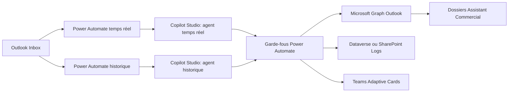
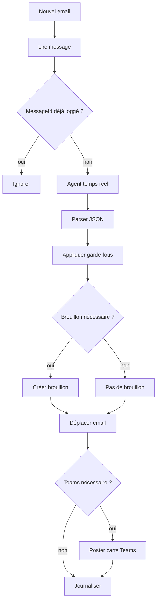
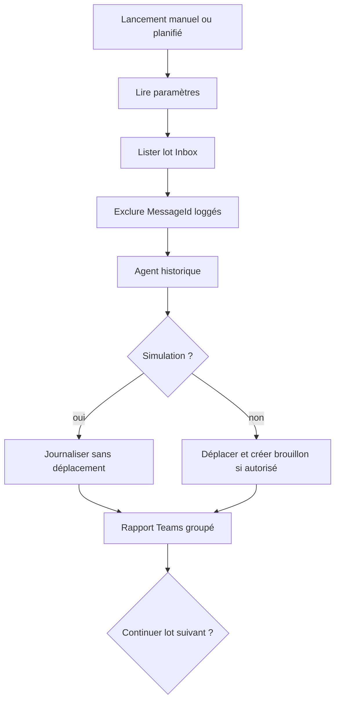

# Architecture

## Vue d'ensemble



## Modules

`Assistant Commercial - Temps réel`
- Déclenché à chaque nouvel email.
- Classe et score l’email.
- Crée un brouillon si nécessaire.
- Déplace l’email vers le dossier cible.
- Alerte Teams quand Jérémy doit intervenir.
- Journalise chaque décision.

`Assistant Commercial - Nettoyage Historique`
- Déclenché manuellement ou planifié.
- Fonctionne par lots et pagination Graph.
- Démarre en simulation.
- Évite les alertes unitaires.
- Produit un rapport Teams groupé.
- Identifie les opportunités oubliées.

## Dossiers Outlook

```text
Assistant Commercial
├── 01 - À traiter
├── 02 - Brouillons créés
├── 03 - Question posée Teams
├── 04 - À surveiller
├── 05 - Non important
├── 06 - À supprimer - quarantaine
├── 99 - Traité
├── Historique - À traiter
├── Historique - Opportunités oubliées
├── Historique - À surveiller
├── Historique - Non important
├── Historique - Quarantaine suppression
└── Historique - Nettoyé
```

## Stockage

Option MVP : SharePoint Lists.
- Rapide à créer.
- Suffisant pour un pilote.
- Limites sur les clés uniques et gros volumes.

Option production : Dataverse.
- Meilleure gouvernance.
- Clés alternatives sur `MessageId`.
- Sécurité par rôle.
- Audit et vues métier plus robustes.

## Idempotence

Avant tout traitement :
1. Lire `AssistantCommercial_EmailLog`.
2. Lire `AssistantCommercial_HistoricalCleanup` pour l’historique.
3. Si `MessageId` existe, ignorer.
4. Journaliser les erreurs séparément au lieu de relancer sans contrôle.

## Flux de décision temps réel



## Flux historique


